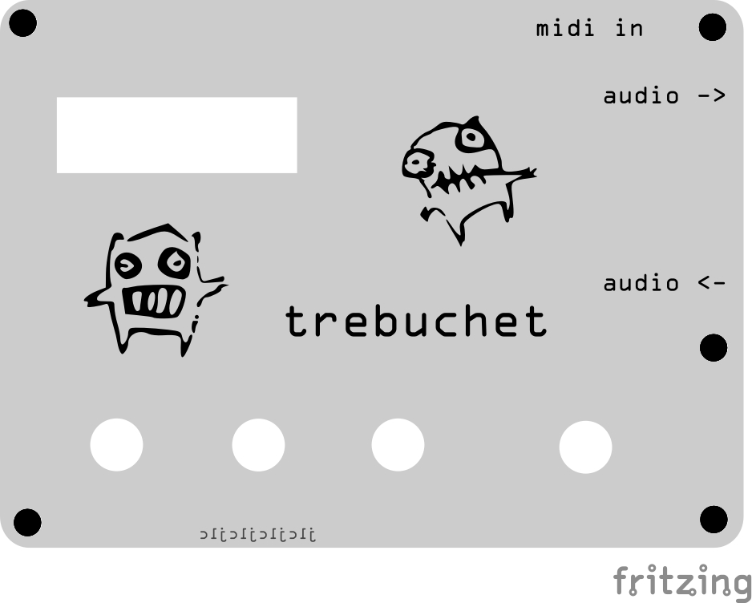

# trebuchet
trebuchet is an arduino/lgt based synth that primarily plays swinging euclidean transforms on midi drums using the vsi VS1053b. Oh and midi synth, any voice. Oh, and sample mangler in alternate firmware.

The first batch of PCBs are on the way, so there should be some developments here soon :)
